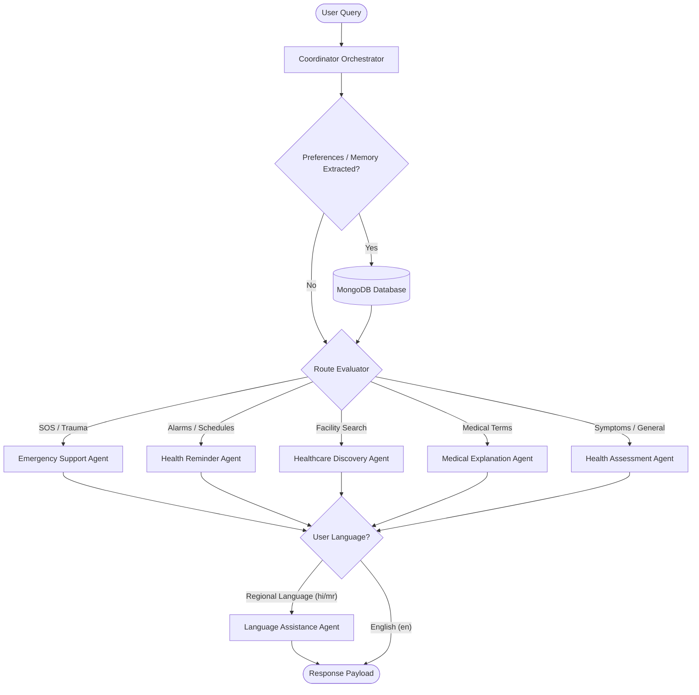

# 🩺 SwasthyaAI - Rural Health Navigator

**SwasthyaAI** is an agentic AI-driven healthcare navigator engineered specifically for rural, remote, or underserved communities. Built on the MERN (MongoDB, Express, React, Node.js) stack and powered by Google Gemini, the platform helps overcome barriers to healthcare access, low medical literacy, and language differences.

---

## 🚀 Key Features

- **智能 AI 症状评估 (Symptom Assessment):** Evaluates symptoms, determines urgency levels (Emergency, Urgent, Routine), and provides actionable home care guidance alongside dynamic follow-up questions.
- **🚨 紧急急救与 SOS (Emergency First-Aid & SOS):** Instantly parses high-urgency keywords (e.g., snakebite, chest pain, choking) to serve immediate visual first-aid instructions, alongside a one-click SOS button to broadcast GPS location coordinates via SMS simulation.
- **📍 医疗机构发现 (Healthcare Discovery):** Helps users find the nearest hospitals, clinics, pharmacies, and government health centers based on proximity and specific medical requirements.
- **⏰ 健康用药提醒 (Medicine & Appointment Reminders):** Allows users to set schedules for medication doses, vaccination alerts, and doctor appointments.
- **🗣️ 多语言翻译支持 (Multilingual Regional Translation):** Automatically detects user language preferences (Hindi, Marathi, English) and translates all AI insights, ensuring seamless accessibility.
- **👴 老年人/无障碍辅助 (Accessibility Widget):** Features an interactive accessibility panel offering text-to-speech, adjustable font size controls, and high contrast mode.

---

## 📊 System Architecture & Agentic Workflow

The application leverages a multi-agent orchestration pattern. Incoming queries are intercepted by a coordinator that checks user context, schedules database updates, routes the query to the correct expert agent, and coordinates translation if necessary.



### 🧠 Agent Directory & Responsibilities

1. **Coordinator Orchestrator (`Orchestrator.js`):** Manages user session state, loads history, extracts preferences, makes routing decisions, and acts as the final aggregator.
2. **Health Assessment Agent (`HealthAssessmentAgent.js`):** Interacts with Gemini to gauge clinical urgency and formulate patient guidance.
3. **Healthcare Discovery Agent (`HealthcareDiscoveryAgent.js`):** Performs local/geospatial searches to identify and list medical centers near the user.
4. **Medical Explanation Agent (`MedicalExplanationAgent.js`):** Converts complex medical reports, abbreviations, and terminology into plain, easy-to-understand language.
5. **Emergency Support Agent (`EmergencySupportAgent.js`):** Dispatches step-by-step first-aid steps for critical incidents and executes the location SMS broadcast payload.
6. **Reminder Agent (`ReminderAgent.js`):** Schedules and fires medicine/appointment notifications.
7. **Language Assistance Agent (`LanguageAssistanceAgent.js`):** Interfaces with Gemini to handle dynamic regional translations.

---

## 📂 Project Directory Structure

```text
capstone/
├── backend/                  # Node.js + Express backend server
│   ├── agents/               # Multi-Agent orchestrators & handlers
│   │   ├── Orchestrator.js
│   │   ├── HealthAssessmentAgent.js
│   │   ├── EmergencySupportAgent.js
│   │   └── ...
│   ├── models/               # MongoDB Mongoose schemas
│   ├── routes/               # Express API endpoints
│   ├── server.js             # Main server entrypoint
│   └── package.json
├── frontend/                 # Vite + React frontend dashboard
│   ├── public/
│   ├── src/
│   │   ├── components/       # Shared UI components (Navbar, Accessibility widget)
│   │   ├── context/          # React authentication and theme contexts
│   │   ├── pages/            # Frontend pages (Dashboard, Assistant, Finder, SOS)
│   │   ├── App.jsx           # Main routing entry
│   │   └── main.jsx
│   └── package.json
├── package.json              # Root project composer package
└── README.md                 # Project documentation
```

---

## 🛠️ Local Development & Setup

### Prerequisites

- [Node.js](https://nodejs.org/) (v16+ recommended)
- [MongoDB](https://www.mongodb.com/) running locally or via Atlas connection URI
- Google Gemini API Key (Optional; falls back to offline rule-based NLP if key is missing)

### Installation & Initialization

From the **project root directory**, run the custom conductor script to install all dependencies for both root, frontend, and backend packages:

```bash
npm run install-all
```

### Configuration

1. Create a `.env` file in the `/backend` folder:
   ```env
   PORT=5000
   MONGO_URI=mongodb://localhost:27017/swasthya_ai
   GEMINI_API_KEY=your_gemini_api_key_here
   JWT_SECRET=your_super_secret_jwt_key
   ```
2. (Optional) Run the database seed command to pre-populate nearby rural healthcare facilities:
   ```bash
   npm run seed
   ```

### Running the Application

To run the frontend and backend servers concurrently, execute:

```bash
npm run dev
```

- **Frontend:** http://localhost:5173
- **Backend:** http://localhost:5000
